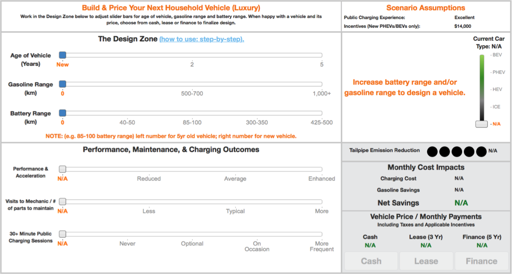
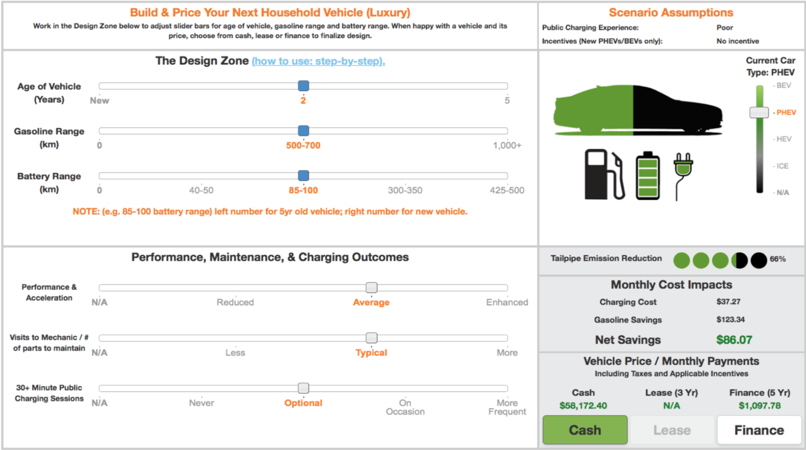

```{r To-Do-List, eval=FALSE, include=FALSE}
1. Built a package to house the data. Package builds and loads without issue
2. Write a paper that demonstrates rrwf.
  2.1 Use template - Using elsevier
  2.2 Have a topic - Writing about Discrete choice analysis being applied to the 2018 mitl survey VDS.
  2.3 Build tables and figures, reference in text to demonstrate citation functionality.
  2.4 Run analysis in document, with results generating tables or figures to demonstrate reproducability
  2.5 Course elements to include: Headers, Tables, Latex formatting, inline formatting, host file on GitHub, sharing of the data is restricted, package is created with the data, the dataset is well documented,
```


```{r include=FALSE}
library(tidyverse)
library(evd)
library(mlogit)
library(kableExtra)
library(knitr)
library(VDS)
library(MASS)
```

Introduction
============

The transportation sector represents one of the single largest contributors to greenhouse gas emissions (GHGs) and other pollutants in Canada. The  uptake of electric vehicles (EVs), to date, has been limited. Various authors have explored attitudes towards EVs and have generally found purchase cost, range anxiety, and battery maintainability to be the primary barriers to purchase (see @Mohamed2018). In this paper, as a part of the _McMaster Institute for Transportation and Logistic's_ study on _The Social Costs and Benefits of Electric Mobility in Canada_, we aim to understand how consumers would design and purchase a vehicle of their preferred body type (sub-compact, Luxury Sedan, SUV, etc.) at a realistic price point. This paper presents a small number of results from the survey itself in addition to some basic discrete choice modeling, looking at the impact of purchase, price, operating cost, incentives, and body types. First, we will review the data collection process and aspects of the collection instrument, then present the data analysis, followed by some of the survey results and how the vehilces designed compare, lastly some conclusions are drawn.

Data Collection
=================================

Data was collected via an electronic survey completed by a third-party firm. A total of ~20,000 observations were collected, including repeat respondents from a version of the survey conducted in 2015. A total of 16,901 respondents are included in this analysis dataset after removing repeat respondents and other responses inline with other works that have used this dataset as their basis. While other works focus on the results of the full survey (reference, reference, mitl report), this analysis looks at the experimental section added for the 2018 iteration of the survey, referred to as the _Vehicle Design Scenarios_ (VDS). 

```{r fig-VDS-Int, echo=FALSE, fig.align='center', fig.cap="\\label{fig:VDS-Int} Initalized Vehicle Design Scenario", out.width="100%"}

```
    
Respondents were asked to go through two VDSs where they would choose a set of powertrain features (gasoline and electric range) that produce a vehicle, at a price, they would be willing to purchase. It is worth noting that as a part of the respondent screening process, only responses that had some degree of intention of purchasing a vehicle in the near future (as opposed to zero intent) were asked to complete the survey. In each of the two scenarios, respondents where given a number of assumptions to respond to, including: the ease or challenge they could charge their EVs (Charging stations being nearby, no wait time to plug in, and fast charging times - or not), a range of government cash incentives applied to the purchase price ($0, $7000, and $14000), and whether or not respondents would be able to readily charge their vehicles at home with minimal need for public charging otherwise. These assumptions could not be changed by the respondent. 

Inside of the VDS respondents, were able to assess how the performance, maintainability, and charging outcomes of the vehicle designed would change as the age, gasoline range, and electric range values were changed to create different configurations. Additionally, respondents were given information on the tailpipe emissions, in respect to a standard internal combustion engine, information on the estimated cost to charge their vehicle (based on the capacity of existing battery technology and their specified annual kilometres driven), and how much they may, potentially save on gasoline. The final piece of information given is an approximation of the vehicle purchase price (based off of existing vehicles and black book values are used to estimate the value of used vehicle prices), after tax and incentives, which is also presented as lease and financing payments. The standard initialization of the VDS, Figure \ref{fig:VDS-Int}, begins with all sliders set to zero values. Respondents are able to adjust the age and range sliders as many times as they perceived necessary, but are required to move either the gasoline or electric range sliders at least once to complete a vehicle configuration and choose a payment method to proceed. Once a configuration has been selected, Figure \ref{fig:VDS-Sel}, the aforementioned fields are populated and adjust in real-time as the respondent alters their configuration. 

```{r fig-VDS-Sel, echo=FALSE, fig.align='center', fig.cap="\\label{fig:VDS-Sel}Vehicle Design Scenario with Configuration", out.width="100%"}

```

Data Analysis
=============

After cleaning the data of bad responses, as defined by too few slider changes (less than 1) in the VDS or completeing the VDS too fast or too slowly (+- 3 standard deviations of the mean), we analyze the 16, 758 remaining responses. As discussed above, respondents were asked about the type of vehicle they would be interested in purchasing in the future, in addition to their annual kilometerage. These values were used to influence the purchase price of the vehicle (which varys by the body type and the powertrain) and informed the operating cost calculation (which estimates the monthly cost to operate the vehicle based on how far the respondent drives), discussed in detail in Appendix 1.

```{r Data Cleaning, include=FALSE, }

#Load survey data from package into data frame.

df <- VDS_Data

# The focus of this work is on the design space exercise. Since the DS was presented near the end of the survey, there is concern that some respondents rushed through or did not adequately explore the tool. The effort here is to limit the number of those respondents from affecting the analysis.

min(df$TIME1)
mean(df$TIME1)
max(df$TIME1)
min(df$CHANGES1)
df$CHANGES1 <- as.numeric(df$CHANGES1)
mean(df$CHANGES1)
max(df$CHANGES1)

# The shortest amount of time and the least number of chages made to the exercise are both zero, which is unacceptable. The other concern is that some respondents spent excessive amounts of time to complete the design space and their responses may not be truly reflective. Respondents are filtered out if more than 20 minutes was taken to complete the exercise. The average time spent to complete the exercise was 3 minutes. Additionally, there is concern that respondents did not spend an adequate amount of time to fully understand the exercise. The removal of respondents is based off of the distribution of responses, those outside of 3 standard distributions of the data are considered to be outliers and are excluded from the analysis. A sensitivity analysis may be completed to compare the truncated dataset and the affect on the results, against all non-zero time and change values (i.e., any respondents who did not complete the design space are not included).

#Remove respondents that spent 0 seconds on the design space
df.Clean <- df %>% filter(TIME1 != 0)

#Calculate time mean and std dev for z-scores
df.Clean$time_sd <- sd(df.Clean$TIME1)*sqrt((length(df.Clean$TIME1)-1)/(length(df.Clean$TIME1)))
df.Clean$time_mean <- mean(df.Clean$TIME1)
df.Clean$Z_Score <- (df.Clean$TIME1 - df.Clean$time_mean) / df.Clean$time_sd
range(df.Clean$Z_Score) # Range of z-scores.

#Remove Time values less than -3 and greater than +3 steps from the mean
df.Clean <- df.Clean %>% filter(Z_Score >= -3 & Z_Score <= 3)

#Respondents were allowed, and encouraged, to make as many changes (moving the slider bars to different values) as they felt necessary to understand the different options available to them. Based off of the random geneation pattern, it is plausible that an individual could have been initialized with a vehicle combination they were content with (e.g., ICE-configuration with low purchase and operating cost) and as such respondents at minimum needed to only move the slider bar once to be able to continue. Respondents who made zero changes are removed.

df.Clean <- df.Clean %>% filter(CHANGES1 != 0)

VDS <- df.Clean
rm(df, df.Clean)
```

```{r Build Dataframe for Model Est., echo=FALSE, warning=FALSE}
# Select and reorder the columns in the data frame to prepare them to be transformed for the mlogit model. Fields are ordered by the different choices provided to respondents for the purchase and operating cost. Two of the field names are changed to be in the appropriate format for the 'varying' function to identify them correctly.
# This function lives here as the reordered datatable feeds into the two following boxplots.
df2 <- VDS[,c(1:114, 117, 120, 123, 126, 129, 115, 116, 118, 119, 121, 122, 124, 125, 127, 128, 130:ncol(VDS))]
colnames(df2)[114] <- "oc.hev"
colnames(df2)[107] <- "pp.hev"
df2$Incentive <- df2$INCENT1
df2$Age <- df2$AGE1
model_base <- df2
Behaviour <- mlogit.data(df2, shape = "wide", choice = "depvar", varying = c(106:119)) # Change the shape of the dataframe from wide, to a long format so that the mlogit function can read the data and estimate the models.
```

```{r prop, echo=FALSE, fig.cap= "\\{tab:prop} Purchase Price, Operating Cost, and Proprotion of Vehicles Designed"}
Proportion <- VDS %>% mutate(depvar = factor(depvar, 
                                levels = c("ice", "hev", "phevse", "phevle", "phevlg", "bevs", "bevl" ), labels = c("1","2","3","4", "5", "6", "7"))) %>%
  group_by(depvar) %>%
  summarise(no_rows =length(depvar))

df <- data.frame(Powertrain = c("ICE", "HEV", "PHEV SE", "PHEV LE", "PHEV LG", "BEV SE", "BEV LE"),
                 "$Mean Purchase Price$" = c(mean(VDS$pp.ice), mean(VDS$pp.iceh), mean(VDS$pp.phevse), mean(VDS$pp.phevle), mean(VDS$pp.phevlg), mean(VDS$pp.bevs), mean(VDS$pp.bevl)),
                 "Median Purchase Price" = c(median(VDS$pp.ice), median(VDS$pp.iceh), median(VDS$pp.phevse), median(VDS$pp.phevle), median(VDS$pp.phevlg), median(VDS$pp.bevs), median(VDS$pp.bevl)),
                 "Mean Operating Cost" = c(mean(VDS$oc.ice), mean(VDS$oc.ice_hybrid), mean(VDS$oc.phevse), mean(VDS$oc.phevle), mean(VDS$oc.phevlg), mean(VDS$oc.bevs), mean(VDS$oc.bevl)),
                 "Median Operating Cost" = c(median(VDS$oc.ice), median(VDS$oc.ice_hybrid), median(VDS$oc.phevse), median(VDS$oc.phevle), median(VDS$oc.phevlg), median(VDS$oc.bevs), median(VDS$oc.bevl)),
                 Proportion = (Proportion$no_rows/16758)*100
                 )
df %>%
  kable(
    digits = 2,
    col.names = c("", "Mean", "Median", "Mean", "Median", "As Selected"),
    align = "c",
    booktabs = TRUE,
    caption = "Purchase Price, Operating Cost, and Proprotion of Vehicles Designed"
  ) %>%
pack_rows("Gasoline Only", 1, 2) %>%
  pack_rows("Gasoline & Electricity", 3, 5) %>%
  pack_rows("Electricity Only", 6, 7) %>%

  add_header_above(c("Vehicle Powertrain" = 1, 
                     "Purchase Price˜ ($)" = 2, 
                     "Operating Cost* ($)" = 2, 
                     "Proportion (%)" = 1),
                   escape = TRUE) %>%
  
  footnote(c(paste("˜ Approximate cost to purchase a class-represntative vehicle, inclusive of tax"),
             paste("* Approximate cost to operate (drive) a class-representative vehicle for 1,000km"))) %>%
  kable_styling()
```

##Initial Outcomes
The purchase price and operating cost of vehicles, in addition to the percentage of vehicles designed by powertrain designation, is reviewed in Table\ref{tab:prop}. Of particular interest is the popularity of the long-electric range plug-in hybrid electric powertrain, with 53.65% of respondents _designing_ this option. The ICE and PHEV short-electric round out the top three selections, with the remaining powertrains accounting for only 15% of designs. Predicted to be of great influence is how the operating cost was presented to respondents; rather than in ambigous terms of per-so-many-kilometres, a clear cut monthly dollar value was defined. The PHEV long-electric is not the cheapest vehicle to purchase, and is actually considerably more expensive than the most of the other powertrain combinations. This is a curious result which will require further validation and testing. Of concerns noted, is that for respondents who were fatigued at this stage of the data collection (the VDS was towards the end), only moving the sliders once or twice may have been enough for them and were not interested in vesting the time to generate a more reflective response. Further data cleaning could be enacted to review this phenomena, which further consideration of the time spent and changes made variables. The variance in vehicle purchase price by body type and powertrain is shown in Figure \ref{fig-boxplotPP} and the variance in purchase price by powertrain, incentive, and vehicle age is shown in Figure \ref{fig-boxplot-PP-InctAge}. The boxplots clearly demonstrate that vehicle purchase price decreases for new vehicles with the incentive levels, but notably incentives do not impact the value of used vehicles. Rather, the purchase prices fall due to depreciation. The VDS took into active consideration the relative cost of different vehicle body types and has integrated these variances into the experiment, as presented. 

Exploring the data of the boxplots more with more depth, we look at Table \ref{tab:prop2} for the breakdown by incentive, age, and powertrain. A surprisingly result is how marginal the variations between incentive groups are in the proportion of vehicles designed. While this table does not break out the results to include the seven body types, there is virtually no meaningful change as a result of increasing incentives, seeing less than a .4% change for the fully electric BEVs and less than 1% for the PHEVs at the maximum $14 000 incentive level.

To further evaluate and analyze the data, a very brief discrete choice model is looked at (see @Train2009).

```{r fig-boxplotPP, echo=FALSE, fig.align='center', fig.cap="\\label{fig-boxplotPP}Purchase Cost Variance by Body Type", out.width="100%"}
bp.pp <- ggplot(df2, aes(depvar, CASH_PP1)) + geom_boxplot() + labs(x="Powertrain", y= "Purchase Price ($)", title = "Purchase Cost of Vehicles by Powertrain and Body Type")
bp.pp <- bp.pp + facet_wrap(~BODY_TYPE)
bp.pp
```

```{r fig-boxplot-PP-InctAge, echo=FALSE, fig.align='center', fig.cap="\\label{fig-boxplot-PP-InctAge}Purchase Cost Variance by Powertrain, Incentives, and Vehicle Age", out.width="100%"}
df2$depvar <- factor(df2$depvar, labels = c("BL", "BS", "I", "H", "PLE", "PLG", "PSE"))
bp.oc <- ggplot(df2, aes(x = depvar, y=CASH_PP1)) + geom_boxplot() + labs(x="Powertrain", y= "Purchase Cost ($)", caption = "Incentive in $s, Age in Years", title = "Purchase Cost of Vehicles by Powertrain, Incentive, and Vehicle Age")
bp.oc <- bp.oc + facet_grid(Age~Incentive, labeller = label_both)
bp.oc
```

```{r prop2, echo=FALSE, warning=FALSE, fig.cap= "\\{tab:prop2} Mean Purchase Price of Vehicle by Powertrain, Incentive, and Vehicle Age"}
Proportion2 <- VDS %>% mutate(depvar = factor(depvar, 
                                levels = c("ice", "hev", "phevse", "phevle", "phevlg", "bevs", "bevl" ), labels = c("1","2","3","4", "5", "6", "7"))) %>%
  group_by(INCENT1,depvar) %>%
  summarise(no_rows =length(depvar))

prop2 <- data.frame(
                 "Powertrain" = c(rep(c(Powertrain = c("ICE", "HEV", "PHEV SE", "PHEV LE", "PHEV LG", "BEV SE", "BEV LE")) )),
                 
                 "New Vehicle" = c(mean(VDS$pp.ice[VDS$INCENT1==0 & VDS$AGE1==0]), mean(VDS$pp.iceh[VDS$INCENT1==0& VDS$AGE1==0]), mean(VDS$pp.phevse[VDS$INCENT1==0& VDS$AGE1==0]), mean(VDS$pp.phevle[VDS$INCENT1==0& VDS$AGE1==0]), mean(VDS$pp.phevlg[VDS$INCENT1==0& VDS$AGE1==0]), mean(VDS$pp.bevs[VDS$INCENT1==0& VDS$AGE1==0]), mean(VDS$pp.bevl[VDS$INCENT1==0& VDS$AGE1==0]),
                                   mean(VDS$pp.ice[VDS$INCENT1==7000& VDS$AGE1==0]), mean(VDS$pp.iceh[VDS$INCENT1==7000& VDS$AGE1==0]), mean(VDS$pp.phevse[VDS$INCENT1==7000& VDS$AGE1==0]), mean(VDS$pp.phevle[VDS$INCENT1==7000& VDS$AGE1==0]), mean(VDS$pp.phevlg[VDS$INCENT1==7000& VDS$AGE1==0]), mean(VDS$pp.bevs[VDS$INCENT1==7000& VDS$AGE1==0]), mean(VDS$pp.bevl[VDS$INCENT1==7000& VDS$AGE1==0]),mean(VDS$pp.ice[VDS$INCENT1==14000& VDS$AGE1==0]), mean(VDS$pp.iceh[VDS$INCENT1==14000& VDS$AGE1==0]), mean(VDS$pp.phevse[VDS$INCENT1==14000& VDS$AGE1==0]), mean(VDS$pp.phevle[VDS$INCENT1==14000& VDS$AGE1==0]), mean(VDS$pp.phevlg[14000& VDS$AGE1==0]), mean(VDS$pp.bevs[VDS$INCENT1==14000& VDS$AGE1==0]), mean(VDS$pp.bevl[VDS$INCENT1==14000& VDS$AGE1==0])),
                 "2 Year Old Vehicle" = c(mean(VDS$pp.ice[VDS$INCENT1==0 & VDS$AGE1==2]), mean(VDS$pp.iceh[VDS$INCENT1==0& VDS$AGE1==2]), mean(VDS$pp.phevse[VDS$INCENT1==0& VDS$AGE1==2]), mean(VDS$pp.phevle[VDS$INCENT1==0& VDS$AGE1==2]), mean(VDS$pp.phevlg[VDS$INCENT1==0& VDS$AGE1==2]), mean(VDS$pp.bevs[VDS$INCENT1==0& VDS$AGE1==2]), mean(VDS$pp.bevl[VDS$INCENT1==0& VDS$AGE1==2]),mean(VDS$pp.ice[VDS$INCENT1==7000& VDS$AGE1==2]), mean(VDS$pp.iceh[VDS$INCENT1==7000& VDS$AGE1==2]), mean(VDS$pp.phevse[VDS$INCENT1==7000& VDS$AGE1==2]), mean(VDS$pp.phevle[VDS$INCENT1==7000& VDS$AGE1==2]), mean(VDS$pp.phevlg[VDS$INCENT1==7000& VDS$AGE1==2]), mean(VDS$pp.bevs[VDS$INCENT1==7000& VDS$AGE1==2]), mean(VDS$pp.bevl[VDS$INCENT1==7000& VDS$AGE1==2]),mean(VDS$pp.ice[VDS$INCENT1==14000& VDS$AGE1==2]), mean(VDS$pp.iceh[VDS$INCENT1==14000& VDS$AGE1==2]), mean(VDS$pp.phevse[VDS$INCENT1==14000& VDS$AGE1==2]), mean(VDS$pp.phevle[VDS$INCENT1==14000& VDS$AGE1==2]), mean(VDS$pp.phevlg[14000& VDS$AGE1==2]), mean(VDS$pp.bevs[VDS$INCENT1==14000& VDS$AGE1==2]), mean(VDS$pp.bevl[VDS$INCENT1==14000& VDS$AGE1==2])),
                 "5 Year Old Vehicle" = c(mean(VDS$pp.ice[VDS$INCENT1==0 & VDS$AGE1==5]), mean(VDS$pp.iceh[VDS$INCENT1==0& VDS$AGE1==5]), mean(VDS$pp.phevse[VDS$INCENT1==0& VDS$AGE1==5]), mean(VDS$pp.phevle[VDS$INCENT1==0& VDS$AGE1==5]), mean(VDS$pp.phevlg[VDS$INCENT1==0& VDS$AGE1==5]), mean(VDS$pp.bevs[VDS$INCENT1==0& VDS$AGE1==5]), mean(VDS$pp.bevl[VDS$INCENT1==0& VDS$AGE1==5]),mean(VDS$pp.ice[VDS$INCENT1==7000& VDS$AGE1==5]), mean(VDS$pp.iceh[VDS$INCENT1==7000& VDS$AGE1==5]), mean(VDS$pp.phevse[VDS$INCENT1==7000& VDS$AGE1==5]), mean(VDS$pp.phevle[VDS$INCENT1==7000& VDS$AGE1==5]), mean(VDS$pp.phevlg[VDS$INCENT1==7000& VDS$AGE1==5]), mean(VDS$pp.bevs[VDS$INCENT1==7000& VDS$AGE1==5]), mean(VDS$pp.bevl[VDS$INCENT1==7000& VDS$AGE1==5]),mean(VDS$pp.ice[VDS$INCENT1==14000& VDS$AGE1==5]), mean(VDS$pp.iceh[VDS$INCENT1==14000& VDS$AGE1==5]), mean(VDS$pp.phevse[VDS$INCENT1==14000& VDS$AGE1==5]), mean(VDS$pp.phevle[VDS$INCENT1==14000& VDS$AGE1==5]), mean(VDS$pp.phevlg[14000& VDS$AGE1==5]), mean(VDS$pp.bevs[VDS$INCENT1==14000& VDS$AGE1==5]), mean(VDS$pp.bevl[VDS$INCENT1==14000& VDS$AGE1==5])),
                 Proportion = (Proportion2$no_rows/16758)*100)

kable(prop2, 
      align = "c",
      digits = 2,
      booktabs = TRUE,
      col.names = c("Powertrain", "New Vehicle", "2 Year Old Vehicle", "5 Year Old Vehicle", "As Selected"),
      caption = "Mean Purchase Price of Vehicle by Powertrain, Incentive, and Vehicle Age"
      ) %>%
  pack_rows("$0 Incentive", 1, 7) %>%
  pack_rows("$7 000 Incentive", 8, 14) %>%
  pack_rows("$14 000 Incentive", 15, 21) %>%
  add_header_above(c(" " = 1, 
                     "Average Purchase Price ($)" = 3, 
                     "Proportion (%)" = 1),
                   escape = TRUE) %>%
  kable_styling(latex_options = c("scale_down")) 
 
```

##Estimating an Initial Model

First, a multinomial logit model will be estimated. The initial model is estimated as $depvar = \beta + pp$, while a second model is estimated as $depvar = \beta + pp + oc$. Simply the dependent variable, the powertrain selection, is estimated to be a function of the purchase price and the operating cost. The model output confirms (albeit from a derived dataset), the alternatives (i.e., powertrains) frequencies. The results, in Table \ref{tab:sadmnl}, are otherwise underwhelming. It is not expected that the coefficients would be positive, implying that as the values increase so too does the utility. While potentially true for purchase price, it seems suspicious in terms of operating cost. After the dataset has been validated, a proportional ordinal logistics regression should be estimated in addition to mixed logit models using the polr and gmnl packages.

```{r eval=FALSE, include=FALSE}
#Questions

#What are the questions that we are looking to answer?

#  Using the techniques from the course, provide a summary overview of the data
#  Determine the 
#  Estimate the marginal effects and elasticities
#    Do this with nesting
#  Estimate the probabilities
#  Estimate the willingness to pay
#  Estimate the impact of a new choice (e.g. fuel cell or longer range gasoline vehicles)
#  Compare proportional and non-proportional substitution patterns
  
#Does it make sense to break the data out and run seperate analyses?
#  E.g., by bodytype, incentive level, home charging access
```


```{r sadmnl, echo=FALSE, message=FALSE, warning=FALSE, fig.cap="\\label{tab:sadmnl}Easy Initial Models"}
mod1 <- mlogit(depvar ~  pp, Behaviour, reflevel = "ice")
mod2 <- mlogit(depvar ~  pp + oc, Behaviour, reflevel = "ice")

mod1.summary <- rownames_to_column(data.frame(summary(mod1)$CoefTable), "Variable") %>%
  transmute(Variable, Estimate, pval = `Pr...z..`)
mod2.summary <- rownames_to_column(data.frame(summary(mod2)$CoefTable), "Variable") %>%
  transmute(Variable, Estimate, pval = `Pr...z..`)

mod_table_1 <- full_join(mod1.summary,mod2.summary,  by = "Variable") 

kable(mod_table_1, 
      digits = 4,
      col.names = c("Variable",
                    "Estimate",
                    "p-value",
                    "Estimate",
                    "p-value"
                    ),
      caption = "Initial logit models",
    align = "c",
    booktabs = TRUE
    ) %>%
  kable_styling() %>%
  add_header_above(c(" " = 1,"Initial Model" = 2, "Second Model" = 2))
```

Conclusions
===========

Significant time needs to be spent reflecting on the data analysis and data capture to ensure the validity of these results. It is circumspect that purchase price and operating cost would both be positively related, given the expectation that as operating cost decreased the utility would have increased. The same may be true of purchase price, but there are more variables at play, including for some individuals, a more expensive vehicle may in of itself be of higher utility. Other body types, such as minivans and pickup trucks are naturally more expensive than compact sedans. Regardless, more time is required to analyze the data to determine the validity of the results.

Acknowledgements
================

This study is a part of a research project funded by Social Sciences and Humanities Research Council of Canada (SSHRC) Grant No: 886-2013-0001. The views expressed in this study are those of the authors and do not necessarily reflect the funding authority.

Appendix
========

##Purchase Price and Operating Cost Calculations

Purchase price (pp) is determined by the bodytype (Economy, Intermediate, Sedan, Luxury Sedan, SUV, Minivan, Pickup) and the powertrain (i.e., technology type: ICE; Hybrid; PHEV - Short Electric, Long Electric, Long Gas; and, BEV: Short Range, Long Range).
  ICE and Hybrid are the cheapest options, respectively, across all bodytypes.
  pp is affected by three age levels: New, 2, and 5 years old. New = approximate MSRP value of the powertrain + bodytype configuration; 2 = 65% retained value; and, 5 years = 35% of retained value. 
  pp is affected by three incentive levels: $0, $7000, and $14000. Offered only to new vehicles of the powertrains: Phevse, Phevle, Phevlg, bevs, bevl.
  
Operating Cost (oc) is determined by the bodytype-powertrain combination, the cost of electricity, and the cost of gasoline (87 Octane / regular).
  Electricity rates are determined by whether respondents have access to home charging or not. Those with access paid 13 cents / kWh, those without paid 26 cents / kWh to approximate the cost of needing to use public / 3rd party charging systems.
  Cost of gasoline was determined by the January 2018 average cost of gasoline across Canada's top 20 municipalities, as per reporting by Statistics Canada (Gas = $1.17 per litre). This value does not vary across alternatives.
  oc is calculated as a function of the average cost to travel 1000km in a series of reference vehicles, from full tank to empty on average combined fuel economy. This per 1000km value is then multiplied by the midpoint of the ranges of stated annual kilometres travelled by the respondent (e.g., 5000-10000km = 7500km), in an attempt to approximate the actual cost to operate that specific respondent may incur. A seperate sheet is available without the per-respondent cost calculation.
  
References {#references .unnumbered}
==========